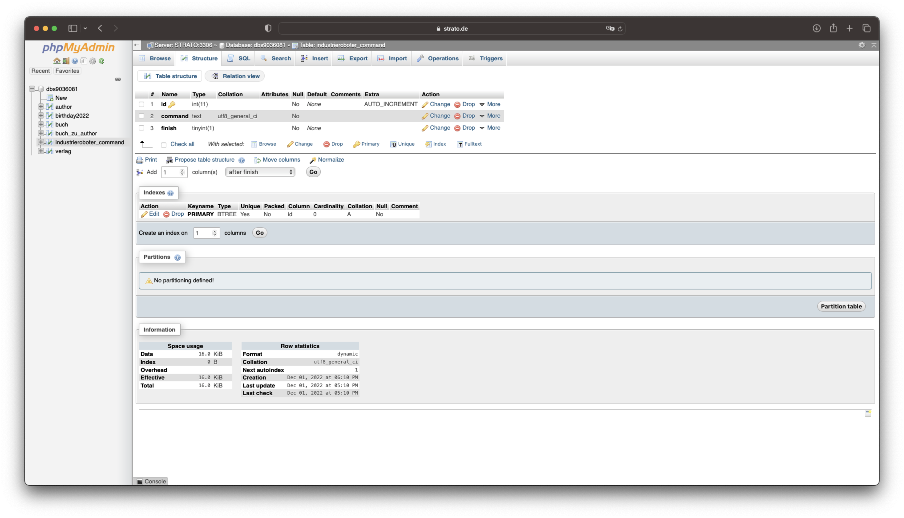

# Industrieroboter

Projekt zur Kommunikation eines Microcontrollers (C++) mit einem Industrieroboter (V+)
  
- Der Microcontroller (ein NodeMCU mit ESP Chip) liest aktuelle Befehle des Webservers aus
- Die Befehle werden dann an den Industrieroboter gemorst
- Dies soll in beide Richtugen funktinieren:
a) Bspw. Sensordaten Übermittlung an Industrieroboter
b) Befehle des Industrieroboters an den Arduino

# Master-Slave Prinzip:

Idee: Die komplette Logik soll auf dem Arduino / NodeMCU erfolgen (C++) und der Industrieroboter führt Befehle aus.
Dies hätte den Vorteil, dass zukünftige Änderungen an der Logik nur auf dem Microcontroller vorgenommen werden müssten.
  
Die Befehle werde in Form des Binärcodes (1 und 0) über ein Relay gesendet:
!(Arduino Relay)(Documentation/arduino.jpeg)

# Website:

Auf der Website lassen sich verschiedenen Formulare, Buttons und Text-Felder platzieren, um Befehle zu verschicken. Der Webserver ist über das Internet erreichbar: [Website](https://manuelmarco.xyz/industrieroboter_2022/) 
Somit lässt sich der Industrieroboter von jedem Gerät aus steuern.

# SQL Datenbank:

Alle Befehle des Webservers werden in einer SQL Datenbank gespeichert. Der Microcontroller fragt den nächsten Befehl ab und setzt diesen dann auf erledigt. Somit könnten auch mehrere Befehle erstellt werden und anschließend in der richtigen Reihenfolge ausgeführt werden. 

